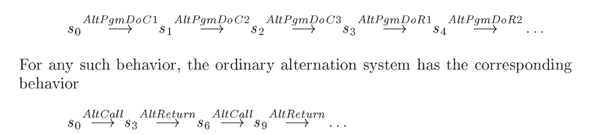
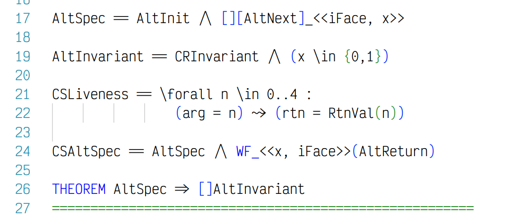
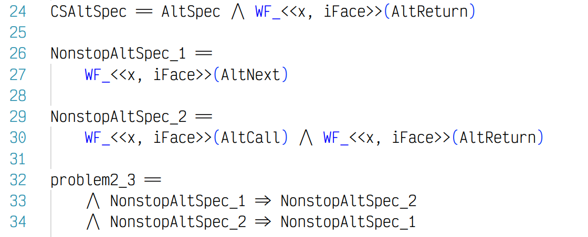

## stuttering step이 왜 필요한가?

만약 stuttering이 없다면, oscillator에서 x가 변할때만 다른 모든 변수들이 바뀔 수 있다. (심지어는 다른 스펙들도, 즉 모든 universe)
즉 모든 상태는 x가 변할때만 바뀐다. 이는 예를 들어 더 빠른 oscillator를 만들 수 없게 만든다.

stuttering 상태를 넣는다고 해서, behavior가 spec을 충족하는 여부가 바뀌면 안된다.
이런 property를 invariant under stuttering이라 부른다.
stuttering 상태에서 invariant가 성립하지 않는 상황은, 말이 안된다.

> 구별되지 않는 상태를 구별하는 것이기 때문이다.

시스템이 stuttering 상태에 계속 존재하면, 이를 system halts라고 본다.

> Halting is sometimes called termination or deadlock

behavior는 infinite seq of states다.
종료 상태가 infinite한 stuttering으로 표현되기 때문이다.

> Just because the system halts doesn’t mean the rest of the universe stops; other variables can keep changing.
> 해당 시스템의 variable만 unchanged함, 외부의 다른 시스템은 변할 수 있음 

## AltSpec과 AltPgmSpec의 차이

3가지 명령을 한 step에 다루는가, 나누어 다루는가의 차이이다.

```
cl: await(x==0); c2: Call; c3: x =1
```

이 명령을 single step으로 만든게 AltSpec이고,
three separate step으로 나눈 것이 AltPgmSpec이다. 
AltPgmSpec는 finer-grained specification than AltSpec이라 부른다.



arg와 rtn 변수 관점에서는, 처음 stuttering이 더 있다는 것을 제외하고는 완전 동일하다. 

> AltPgmSpec에서는 준비하는 명령어들로 인한 ( 예: await(x==0) ) 상태 변화도  
> arg, rtn 관점에서는 stuttering이다.

이런 해석, 구현 방법의 차이는 우리가 뭘 원하는가에 달려있다.

오로지 arg, rtn 값에 영향을 미치는 Call, Return action에만 관심이 있다면 AltSpec은 충분한 방법이다.. 
다만 정확한 실제 구현에 있어서는 너무 coarse grained이다. processor는 한번에 
Call, Return, x 바꾸기 연산들을 single step에 하지 못한다.
AltSpec은 Call과 Return이 x를 바꾸기 전에 발생해야 한다는 사실을 알려주지 않는다. 
(단지 동시에 실행된다고 본다.)
조금더 finer grained한 표현이 필요하다면, AltPgmSpec이 좋은 방법이다.

## 2.5 Fairness and Liveness

safety : system does not take wrong step

하지만 결과적으로 무엇인가 수행됨을 알려주지는 않는다. 
언젠가 무엇이 수행된다를 주장하는 것이 liveness이다. 

예로 서버는 모든 클라이언트의 요청에 반응하길 원한다고 가정하자.
다만 클라이언트는 계속 요청을 보낼 필요가 없다. ( 시스템 종료 가능 )

이를 liveness로 표현하면

```
If AltReturn is enabled, then an AltReturn step must eventually occur.
```

> action AltReturn is enabled  
> 여기서는 AltCall이 발생했고, 이후 AltReturn이 발생하지 않은 상황을 말한다. ( AltReturn을 수행 가능한 상태 )

이를 tla+에서는 
```
CSAltSpec == AltSpec /\ WF_<x, iFace>(AltReturn)
```
으로 표현한다. (WF : weak fairness)

- If A ever becomes enabled forever, then an A step must eventually occur.
- If A ever becomes enabled forever, then infinitely many A steps must occur.
- Either A is infinitely often not enabled, or infinitely many A steps occurs.


## Problems

Problem 2.1 Use TLC to check that the alternation program implements the discrete oscillator. 

Problem 2.2 Section 2.4.2 sketches specifications FGAltSpec, a finer-grained specification of alternation, and FGAIltPgmSpec, a finer-grained specification of the alternation program. Write modules FGAlternation and FGAlternationPgm that define these specifications. Use TLC to show that FGAltPgmSpec implements FGAltSpec. 

Problem 2.3 (a) Use TLC to check that specification CSAltSpec of Section 2.5.1 satisfies formula CSLiveness of Section 2.5.3. (b) Use TLC to show that the two versions of specification NonstopAltSpec in Section 2.5.2 are equivalent. Hint: For part (b), take AltSpec as the specification and the equivalence of the two fairness conditions as the property to be checked. TLC Version 1 does not handle a property asserting the equivalence of two formulas; you must instead have it check that each formula implies the other. 





Problem 2.4 Write a specification of a discrete oscillator that never stops. Use TLC to show that it is implemented by NonstopAltSpec, but not by CSAltSpec. 

Problem 2.5 Write a specification of the alternation program with client-server fairness. Check that it satisfies the same leads-to property as CSAltSpec. 

Problem 2.6 Write a fine-grained version of the two-phase handshake protocol of Section 2.1 that uses module FGCallReturn, and show that it implements the fine-grained alternation program specification FGAltPgmSpec that you wrote in Problem 2.2 above the refinement mapping z < (¢ + r)%2.